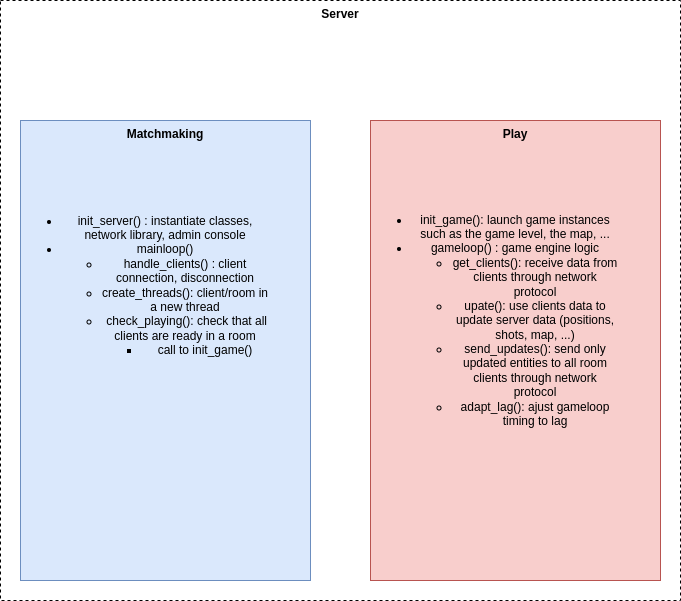

# Server documentation
___
## Joining server
___
### Initiate server
___
When you launch the server executable, no rooms are instantiated. A client can either **create a room** or **join an existing room**. Rooms creation depends on **CPU** resources and running **threads**. Each room will run in a thread.
### Lobby
___
When a client joins or creates a room, he will be waitting in a **lobby** before the game starts. The maximum number of clients per room is **3** for display and visibility reasons. The player can come back to the lobby menu after a level. A **text chat** is available in order for the clients to communicate to each others. For example, they can decide when to launch a level.

## Playing a game
___
The game engine is responsible for the game logic. It is composed of two main functions: **init_game()** and **gameloop()**.
- init_game(): will launch all game needed instances in order for the server to keep track of data. For example, it will load the chosen game level, the corresponding map, the assets and so on...
- gameloop(): is responsible for the communication between the room clients and the server and for the real time data updates in our ECS (Entity Component System).

## Server architecture
___
Server architecture diagram:
